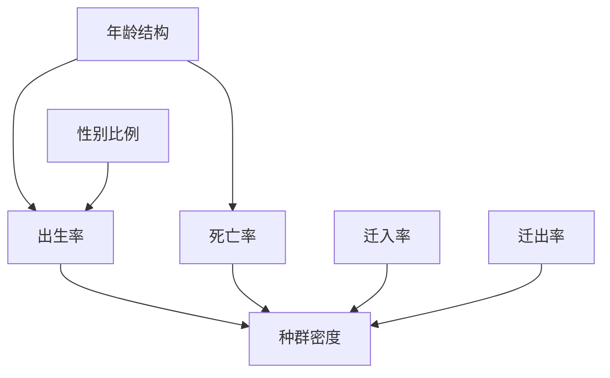

# 选择性必修 2 总结
## 种群生态学
### 种群的数量特征
- 调查方法：
	- 逐个计数适合于**分布范围较小，个体较大的生物**
		- 珙桐
	- 样方法适合于活动能力活动范围不太强的生物
		- 跳蝻（蝗虫幼虫），蚜虫
		- 蒲公英
		- 五点取样法，等距取样法
	- 标记重捕法
- 四个因素
	- 出生率，死亡率
		- 单位时间内出生/死亡的个体数占个体总数的比值
	- 迁入率，迁出率
	- 年龄结构，性别比例
		- 增长型，稳定型，衰退性
		- 利用人工合成的性引诱剂（**生物防治**），改变了正常的性别比例
- 种群最基本的数量特征：**种群密度**

### 种群数量的变化
- 标准公式： $N_t=N_0\lambda^t$
- 环境容纳量：一定的环境条件所能容纳的种群最大数量
	- 提高环境容纳量是保护的根本措施
	- 在 K 处进行捕捞，捕捞量是 K/2 时，可以持续获得高产量

### 影响种群数量变化的因素
- 非生物因素
	- 阳光、温度、水……
	- 典型例子：郁闭度是林下植物种群密度的主要决定因素
- 生物因素
	- 竞争、捕食、寄生……

## 群落
- 物种丰富度：一个群落中的物种数目
- 种间关系
	- 原始合作
	- 互利共生
	- 寄生
	- 捕食
	- 种间竞争
- 结构
	- 垂直结构
		- 森林：乔木、灌木、草本
		- 湖泊：挺水、浮水、沉水
		- 植物的分层和**对光的利用**有关
			- 在陆生群落中，也和温度有关
			- 地下分层和水分、无机盐有关
	- 水平结构
		- 同一地段上种群密度有差别，成**镶嵌**分布
- 生态位
	- 一个物种在群落中的**地位和作用**
		- 动物：需要研究栖息地、食物、天敌和其他物种的关系
		- 植物：研究出现频率、种群密度、植株高度等特征
- 演替
	- 有机物↑，丰富度↑，食物网复杂、群落结构↑

## 生态系统
定义：在一定空间内，由生物群落和它的非生物环境相互作用形成的统一整体

### 结构
组成成分 + 营养结构
- 组分
	- 生产者：生态系统的基石
	- 消费者：加快物质循环
	- 分解者：遗体→无机物

### 能量流动
- 定义：输入、传递、转化、散失
- 特点：单向流动，逐级递减
	- 任何生态系统都必须不断得到来自系统外的能量补充
- 生态金字塔
	- 必定为正：能量
	- 数量反例：昆虫、树
	- 生物量反例：浮游动植物（某一时刻）
- **能量流动的实践意义**
	1. 实现对能量的多级利用（设计生态系统的问题）
		- 沼气池中的沼渣肥田
		- 秸秆做饲料
		- 粪便做沼气
	2. 使能量持续高效地流向对人类最有利的部分（合理调整能量流动关系的问题）
		- 放养的牲畜需要适量，要合理确定载畜量

### 物质循环
生物富集：生物体从周围环境吸收、积蓄物质（元素、难以降解的化合物），使机体内浓度高于环境浓度的现象

### 信息传递
- 意义：生命活动的正常进行和生物种群的繁衍；调节生物的种间关系，进而维持生态系统的平衡
- 三种防治：机械（*不是物理*），化学，生物
	- 利用生物学原理（比如昆虫信息素），就算生物防治
