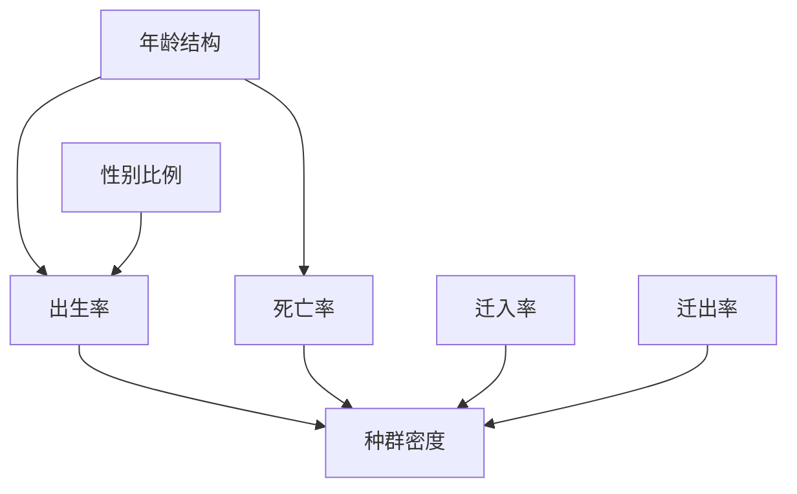

# 选择性必修 2 总结
## 种群生态学
### 种群的数量特征
- 调查方法：
	- 逐个计数适合于**分布范围较小，个体较大的生物**
		- 珙桐
	- 样方法适合于活动能力活动范围不太强的生物
		- 跳蝻（蝗虫幼虫），蚜虫
		- 蒲公英
		- 五点取样法，等距取样法
	- 标记重捕法
- 四个因素
	- 出生率，死亡率
		- 单位时间内出生/死亡的个体数占个体总数的比值
	- 迁入率，迁出率
	- 年龄结构，性别比例
		- 增长型，稳定型，衰退性
		- 利用人工合成的性引诱剂（**生物防治**），改变了正常的性别比例
- 种群最基本的数量特征：**种群密度**

